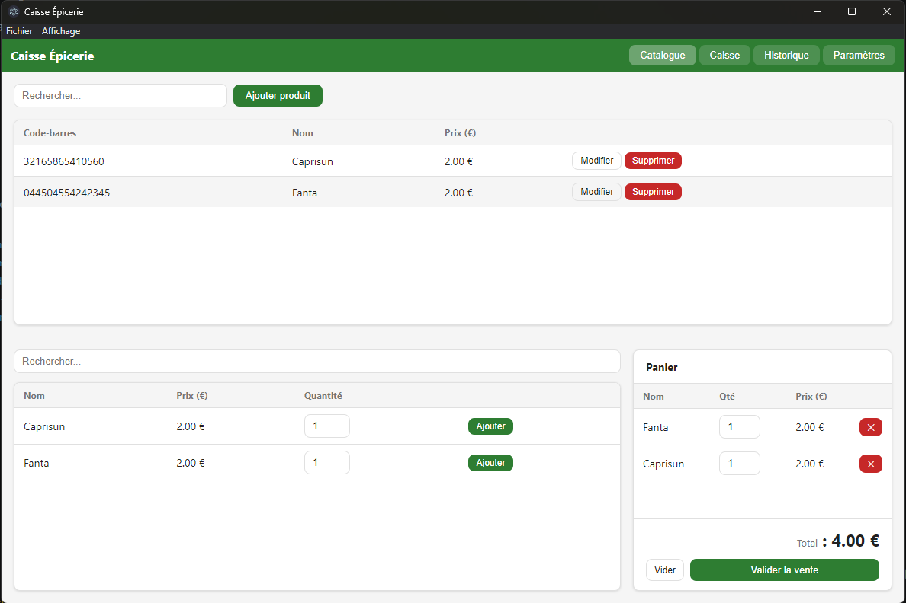
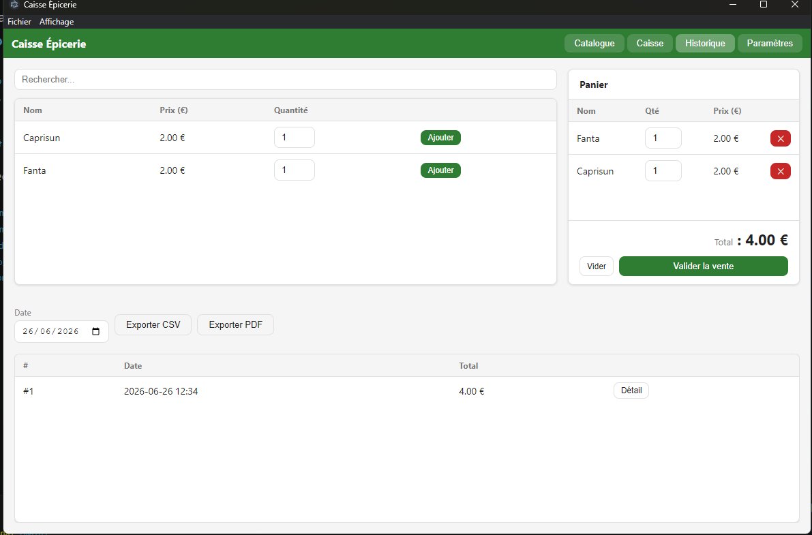
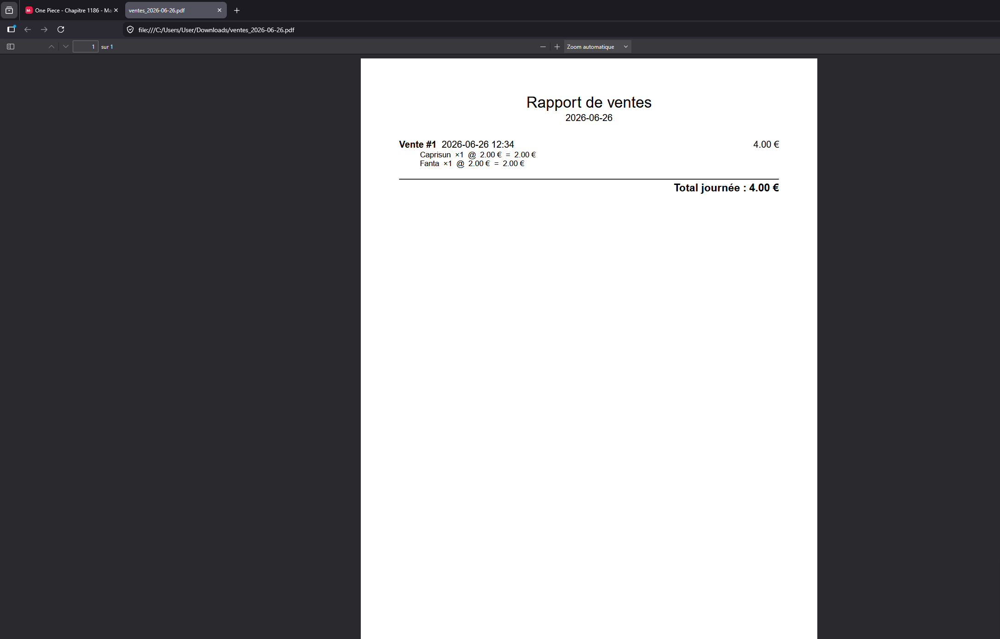

# Caisse Épicerie

Point-of-sale desktop app for a neighborhood grocery store. Built with Electron, SQLite, OpenFoodFacts API.

## Install & Run

```bash
cd tp_final
npm install
npm start
```

## Build installer

```bash
npm run build
# Output in dist/
```

## Tests

```bash
npm test
```

## Screenshots

| Catalogue & Caisse                           | Historique                                     | Export PDF                              |
| -------------------------------------------- | ---------------------------------------------- | --------------------------------------- |
|  |  |  |

## Features

- **Catalogue** — add/edit/delete products; barcode lookup via OpenFoodFacts API
- **Caisse (POS)** — compose cart, set quantities, validate sale
- **Historique** — daily sales list, detail view, CSV export
- **Paramètres** — FR/EN language, light/dark theme (persisted)
- **Offline-first** — all data stored locally in SQLite (`userData/caisse.sqlite`)
- System notifications on product add and sale validation
- Single-instance lock, window geometry persistence

## Architecture

```
main.js          — Main process: window, menu, IPC registration
preload.js       — contextBridge security boundary
src/
  services/      — Business logic (no Electron dependency)
    db.js        — SQLite init + migration
    products.js  — CRUD
    sales.js     — Transactions + CSV export
    openfoodfacts.js — Barcode lookup (offline-safe)
  ipc/           — IPC handlers (Main ↔ Renderer)
    products.ipc.js
    sales.ipc.js
    settings.ipc.js
  renderer/      — UI (no Node access)
    index.html
    app.js
    style.css
    i18n.js
tests/           — Jest unit tests
```

## Data model

```sql
products   (id, barcode, name, price, created_at)
sales      (id, total, created_at)
sale_items (id, sale_id → sales, product_id → products, name, price, quantity)
```
